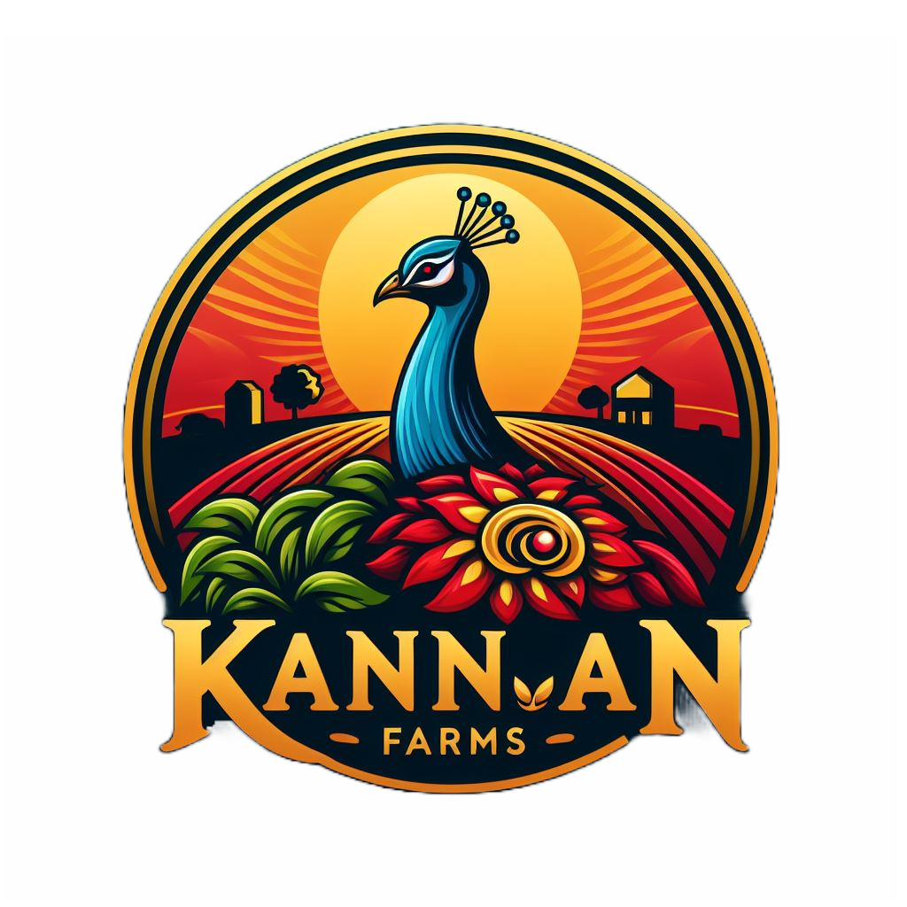

<!DOCTYPE html>
<html lang="en">
<head>
  <meta charset="UTF-8" />
  <meta name="viewport" content="width=device-width, initial-scale=1.0" />
  <title>Kannan Farms - Natural Health Products</title>
  
</head>
<body>
  <header>
    
    <h1>Kannan Farms</h1>
    
Natural Products for a Healthier You

  </header>

  

    

      

        
        
        
        
      

      <h2>Banana Powder</h2>
      
Ideal for children and gym-goers. Natural weight gain and energy booster.

      <a class="whatsapp-button" href="https://wa.me/916381594945?text=I%20want%20to%20order%20Banana%20Powder">Order on WhatsApp</a>
    

    

      

        
        
        
        
      

      <h2>Moringa Powder</h2>
      
Rich in vitamins and antioxidants. A daily dose of health in every spoon.

      <a class="whatsapp-button" href="https://wa.me/916381594945?text=I%20want%20to%20order%20Moringa%20Powder">Order on WhatsApp</a>
    

  

  <footer>
    
&copy; 2025 Kannan Farms. All rights reserved.

  </footer>

  
</body>
</html>
